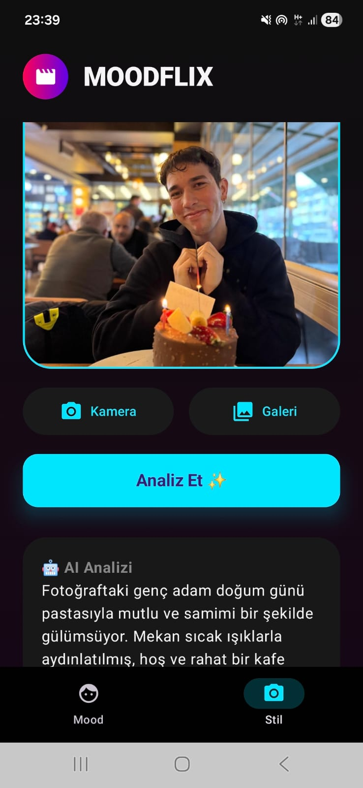
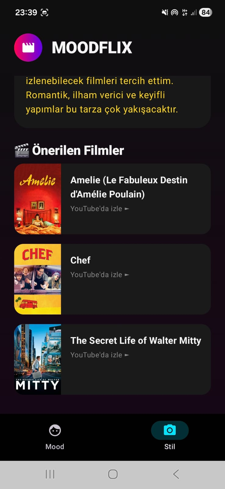

# 🎬 MoodFlix - AI Destekli Film Önerici

MoodFlix, **Google Gemini AI** ve **TMDB API** kullanarak, kullanıcının o anki duygu durumuna veya yüklediği bir fotoğrafın tarzına göre kişiselleştirilmiş film önerileri sunan modern bir Android uygulamasıdır.

## 📱 Uygulama Görselleri

| 🧠 Mood Analizi | 🎨 Stil Analizi | 🍿 AI Sonuçları |
|:---:|:---:|:---:|
|  |  |  |

## ✨ Özellikler

* **🧠 Duygu Analizi (Mood Analysis):** Kullanıcının girdiği metne göre (Örn: "Yağmurlu havada hüzünlü hissediyorum") duygu durumunu analiz eder.
* **📸 Stil Analizi (Style Analysis):** Yüklenen bir fotoğrafın renk paletini ve atmosferini analiz ederek benzer estetiğe sahip filmler önerir.
* **🤖 Google Gemini Entegrasyonu:** Güçlü yapay zeka modeli ile derinlemesine analiz ve isabetli öneriler.
* **🎬 TMDB Entegrasyonu:** Önerilen filmlerin posterlerini The Movie Database üzerinden çeker.
* **🎨 Modern UI:** Jetpack Compose ile geliştirilmiş, neon renkler ve koyu tema (Dark Mode) içeren şık arayüz.

## 🛠️ Teknolojiler

* **Dil:** Kotlin
* **UI:** Jetpack Compose (Material3)
* **AI:** Google Gemini SDK
* **Network:** Retrofit & OkHttp
* **Görsel:** Coil

## 🚀 Kurulum

1.  Bu depoyu klonlayın.
2.  `MoodViewModel.kt` dosyasına kendi **Gemini** ve **TMDB** API anahtarlarınızı ekleyin.
3.  Projeyi çalıştırın ve AI sinema terapistinizin tadını çıkarın!
